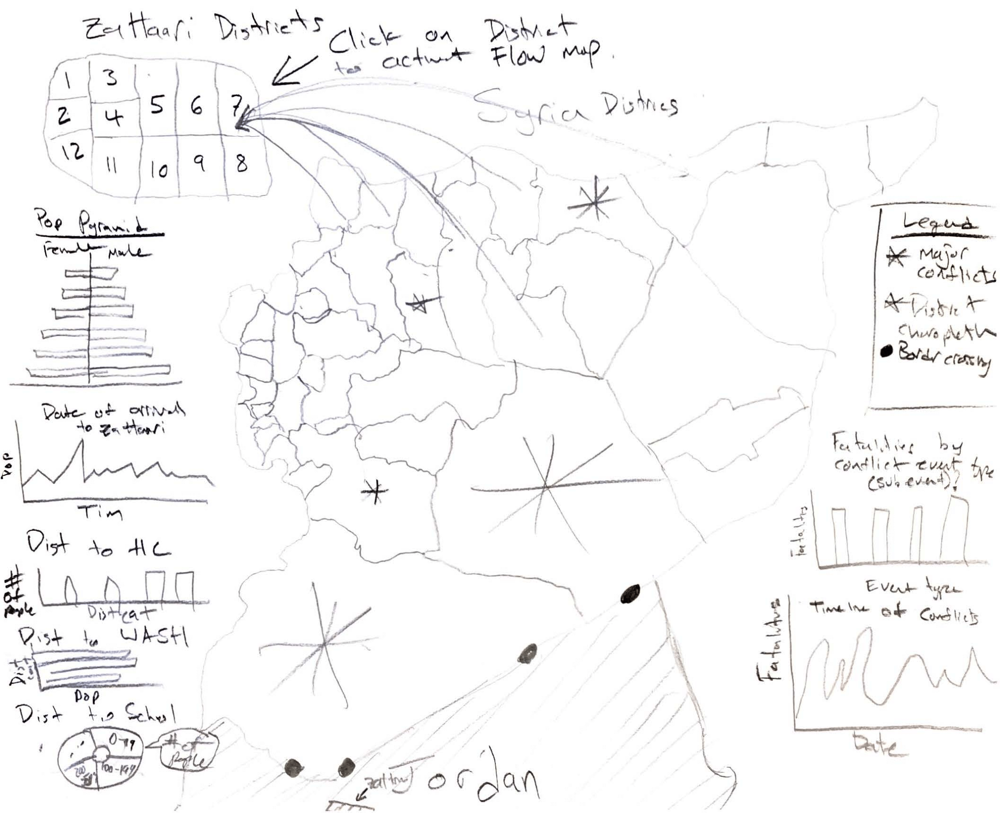

# Zaatari Refugee Camp

**Group members**
- Benjamin Antolin
- Michael Brawner
- Robert Buchalter
- Kristoffer Stuvstad

**The motives**

We would like to create a coordinated view web map of the Zaatari refugee camp in Jordan.

**Description**

In our coordinated view, we are interested in including population density, age, and other demographic factors broken down by entire camp, district and block in the camp. We plan to create a population pyramid for the entire camp, districts, and block groups. We also plan to create chloropleth maps of a variety of demographic factors including age and others.

We are also interested in incorporating timeseries data if we are able to find the data. Possibilities include collecting satellite imagery of the camp over time to spatially visualize the structural change over time.

**Data**

| Name                              | Description                                                  | URL                                                          |
| --------------------------------- | ------------------------------------------------------------ | ------------------------------------------------------------ |
| Population by District (Zaatari)  | Population of Zataari refugee camp by gender and age         | https://data.humdata.org/organization/reach-initiative?groups=jor&q=&ext_page_size=25 |
| Zaatari Survey Data               | Age group, gender, date of arrival, district of origin in syria, shelter type, distance to various infrastucture on each individual in the camp. | <http://reachjor.github.io/pop_count/index.html#>            |
| Zaatari Shapefiles                | This github page host various infrastucture and wastewater data for Zaatari refugee camp. | <https://github.com/impact-initiatives/reach-jor-zaatari-data> |
| Satellite Imagery of Zaatari camp | Google Earth was used to collect satellite imagery over time. | <https://github.com/benjiantolin/zaatari/tree/master/img/SatImagery> |
| Syria Shapefiles                  | Syria districts shapefiles                                   | <https://data.humdata.org/dataset/syrian-arab-republic-administrative-boundaries-populated-places> |
| Syria Conflicts Dataset           | This data set contains event-based data to analyze conflict and crisis | <https://www.acleddata.com/data/>                            |

**Interface Design**

- [Population Pyramid](https://bl.ocks.org/mbostock/4062085) D3
- [Chloropleth Map](https://observablehq.com/@d3/choropleth) D3

**QGIS GUI Screenshot**

**Interface Sketch**

- In this interface sketch we visualize on paper of some of the chart and map display and functions. 
- In this sketch, you can see Syria with conflict across the nation and Syrian refugee data visualized through interactive maps and charts.
